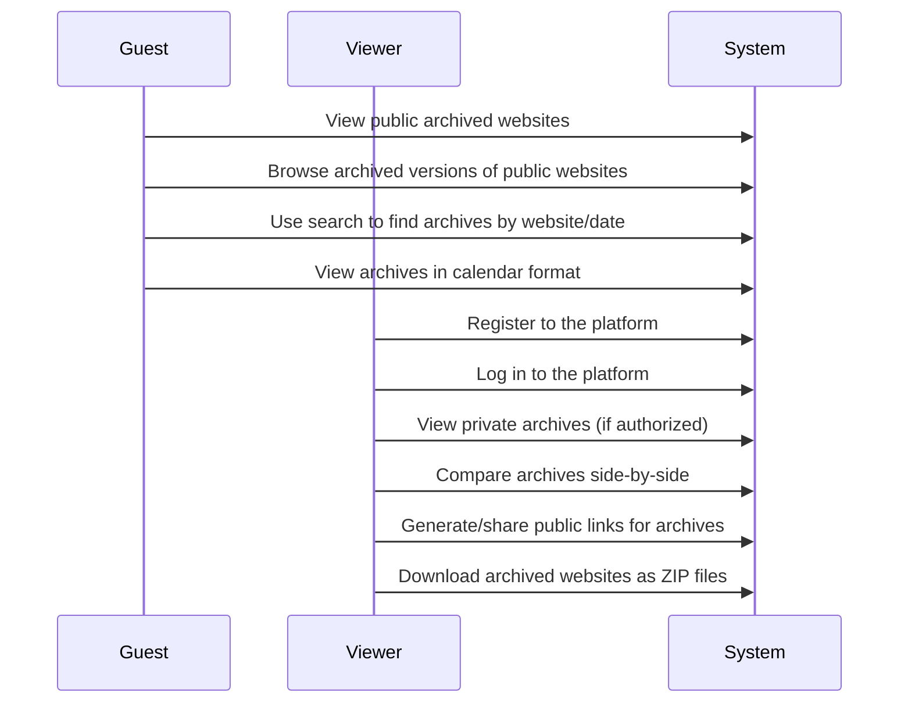
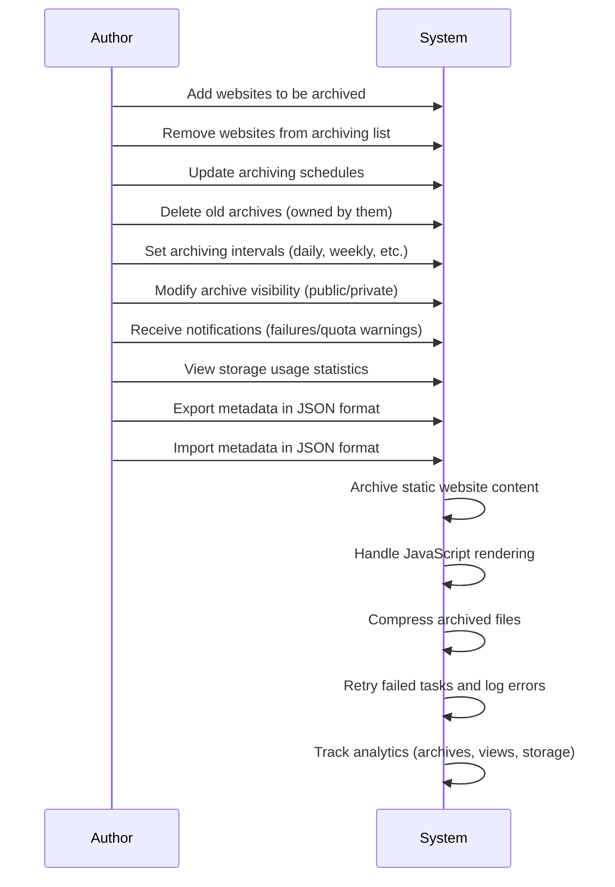
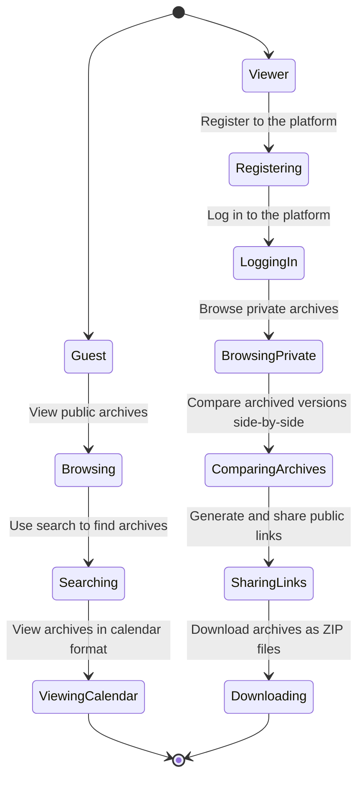
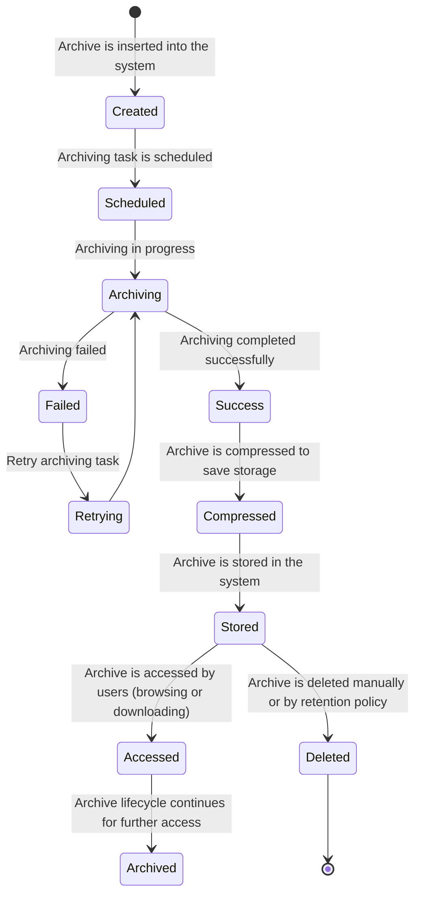
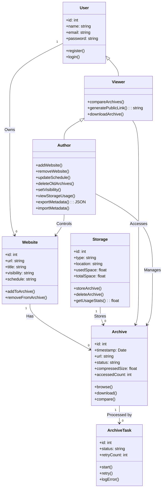

# Sequence

## Guest and Viewer Interactions

```mermaid
sequenceDiagram
    participant Guest
    participant Viewer
    participant System

    Guest->>System: View public archived websites
    Guest->>System: Browse archived versions of public websites
    Guest->>System: Use search to find archives by website/date
    Guest->>System: View archives in calendar format

    Viewer->>System: Register to the platform
    Viewer->>System: Log in to the platform
    Viewer->>System: View private archives (if authorized)
    Viewer->>System: Compare archives side-by-side
    Viewer->>System: Generate/share public links for archives
    Viewer->>System: Download archived websites as ZIP files
```

## Author and System Interactions

```mermaid
sequenceDiagram
    participant Author
    participant System

    Author->>System: Add websites to be archived
    Author->>System: Remove websites from archiving list
    Author->>System: Update archiving schedules
    Author->>System: Delete old archives (owned by them)
    Author->>System: Set archiving intervals (daily, weekly, etc.)
    Author->>System: Modify archive visibility (public/private)
    Author->>System: Receive notifications (failures/quota warnings)
    Author->>System: View storage usage statistics
    Author->>System: Export metadata in JSON format
    Author->>System: Import metadata in JSON format

    System->>System: Archive static website content
    System->>System: Handle JavaScript rendering
    System->>System: Compress archived files
    System->>System: Retry failed tasks and log errors
    System->>System: Track analytics (archives, views, storage)
```

 
 

# State Diagram

## Viewer

```mermaid
stateDiagram-v2
    [*] --> Guest
    Guest --> Browsing: View public archives
    Browsing --> Searching: Use search to find archives
    Searching --> ViewingCalendar: View archives in calendar format
    ViewingCalendar --> [*]

    [*] --> Viewer
    Viewer --> Registering: Register to the platform
    Registering --> LoggingIn: Log in to the platform
    LoggingIn --> BrowsingPrivate: Browse private archives
    BrowsingPrivate --> ComparingArchives: Compare archived versions side-by-side
    ComparingArchives --> SharingLinks: Generate and share public links
    SharingLinks --> Downloading: Download archives as ZIP files
    Downloading --> [*]
```

## Archive

```mermaid
stateDiagram-v2
    [*] --> Created: Archive is inserted into the system
    Created --> Scheduled: Archiving task is scheduled
    Scheduled --> Archiving: Archiving in progress
    Archiving --> Success: Archiving completed successfully
    Archiving --> Failed: Archiving failed
    Failed --> Retrying: Retry archiving task
    Retrying --> Archiving
    Success --> Compressed: Archive is compressed to save storage
    Compressed --> Stored: Archive is stored in the system
    Stored --> Accessed: Archive is accessed by users (browsing or downloading)
    Accessed --> Archived: Archive lifecycle continues for further access
    Stored --> Deleted: Archive is deleted manually or by retention policy
    Deleted --> [*]
```

 
 

# Class Diagram

```mermaid
classDiagram
    class User {
        +id: int
        +name: string
        +email: string
        +password: string
        +register()
        +login()
    }
    class Viewer {
        +compareArchives()
        +generatePublicLink(): string
        +downloadArchive()
    }
    class Author {
        +addWebsite()
        +removeWebsite()
        +updateSchedule()
        +deleteOldArchives()
        +setVisibility()
        +viewStorageUsage()
        +exportMetadata(): JSON
        +importMetadata()
    }
    class Website {
        +id: int
        +url: string
        +title: string
        +visibility: string
        +schedule: string
        +addToArchive()
        +removeFromArchive()
    }
    class Archive {
        +id: int
        +timestamp: Date
        +url: string
        +status: string
        +compressedSize: float
        +accessedCount: int
        +browse()
        +download()
        +compare()
    }
    class ArchiveTask {
        +id: int
        +status: string
        +retryCount: int
        +start()
        +retry()
        +logError()
    }
    class Storage {
        +id: int
        +type: string
        +location: string
        +usedSpace: float
        +totalSpace: float
        +storeArchive()
        +deleteArchive()
        +getUsageStats(): float
    }

    User <|-- Viewer
    Viewer <|-- Author
    User "1" --> "0" Website : Owns
    Website "1" --> "0" Archive : Has
    Archive "1" --> "0" ArchiveTask : Processed by
    Storage "1" --> "0" Archive : Stores
    Viewer --> Archive : Accesses
    Author --> Archive : Manages
    Author --> Website : Controls
```
